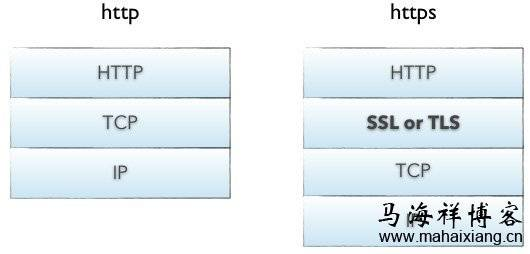

# 线程和进程的区别

多进程模式最大的优点就是稳定性高，因为一个子进程崩溃了，不会影响主进程和其他子进程。（当然主进程挂了所有进程就全挂了，但是Master进程只负责分配任务，挂掉的概率低）著名的Apache最早就是采用多进程模式。

多进程模式的缺点是创建进程的代价大，在Unix/Linux系统下，用fork调用还行，在Windows下创建进程开销巨大。另外，操作系统能同时运行的进程数也是有限的，在内存和CPU的限制下，如果有几千个进程同时运行，操作系统连调度都会成问题。

多线程模式通常比多进程快一点，但是也快不到哪去，而且，多线程模式致命的缺点就是任何一个线程挂掉都可能直接造成整个进程崩溃，因为所有线程共享进程的内存。在Windows上，如果一个线程执行的代码出了问题，你经常可以看到这样的提示：“该程序执行了非法操作，即将关闭”，其实往往是某个线程出了问题，但是操作系统会强制结束整个进程。

在Windows下，多线程的效率比多进程要高，所以微软的IIS服务器默认采用多线程模式。由于多线程存在稳定性的问题，IIS的稳定性就不如Apache。为了缓解这个问题，IIS和Apache现在又有多进程+多线程的混合模式，真是把问题越搞越复杂。

进程：

1、操作系统进行资源分配和调度的基本单位，多个进程之间相互独立

2、稳定性好，如果一个进程崩溃，不影响其他进程，但是进程消耗资源大，开启的进程数量有限制

线程：

1、CPU进行资源分配和调度的基本单位，线程是进程的一部分，是比进程更小的能独立运行的基本单位，一个进程下的多个线程可以共享该进程的所有资源

2、如果IO操作密集，则可以多线程运行效率高，缺点是如果一个线程崩溃，都会造成进程的崩溃

应用：

IO密集的用多线程，在用户输入，sleep 时候，可以切换到其他线程执行，减少等待的时间

CPU密集的用多进程，因为假如IO操作少，用多线程的话，因为线程共享一个全局解释器锁，当前运行的线程会霸占GIL，其他线程没有GIL，就不能充分利用多核CPU的优势

# http由什么组成，和https有什么区别

1. HTTP：是互联网上应用最为广泛的一种网络协议，是一个客户端和服务器端请求和应答的标准（TCP），用于从WWW服务器传输超文本到本地浏览器的传输协议，它可以使浏览器更加高效，使网络传输减少。

2. HTTPS：是以安全为目标的HTTP通道，简单讲是HTTP的安全版，即HTTP下加入SSL层，HTTPS的安全基础是SSL，因此加密的详细内容就需要SSL。
3. http和https使用的是完全不同的连接方式，用的端口也不一样，前者是80，后者是443。
4. http的连接很简单，是无状态的；HTTPS协议是由SSL+HTTP协议构建的可进行加密传输、身份认证的网络协议，比http协议安全。

# cookie和session的区别
Cookies是服务器在本地机器上存储的小段文本并随每一个请求发送至同一个服务器。
具体来说cookie机制采用的是在客户端保持状态的方案。它是在用户端的会话状态的存贮机制，他需要用户打开客户端的cookie支持。cookie的作用就是为了解决HTTP协议无状态的缺陷所作的努力。
cookie的内容主要包括：名字，值，过期时间，路径和域。
session机制采用的是一种在服务器端保持状态的解决方案。
同时我们也看到，由于采用服务器端保持状态的方案在客户端也需要保存一个标识，所以session机制可能需要借助于cookie机制来达到保存标识的目的。而session提供了方便管理全局变量的方式 。
Cookie中只能保管ASCII字符串

# python有什么特性

# python中__new__和__init__区别
* __init__方法做的事情是在对象创建好之后初始化变量。真正创建实例的是__new__方法。 
* __new__方法是静态方法，而__init__是实例方法。
* 
# 列出几种魔法方法并简要介绍用途

__init__:对象初始化方法

__new__:创建对象时候执行的方法，单列模式会用到

__str__:当使用print输出对象的时候，只要自己定义了__str__(self)方法，那么就会打印从在这个方法中return的数据

__del__:删除对象执行的方法

# SCrapy常见组件和流程

# 反爬策略以及解决方法

# 分布式爬虫如何搭建？又是如何解决内存，速度问题的

