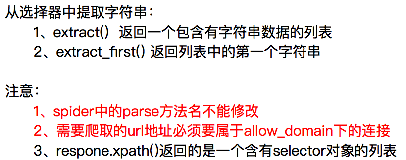
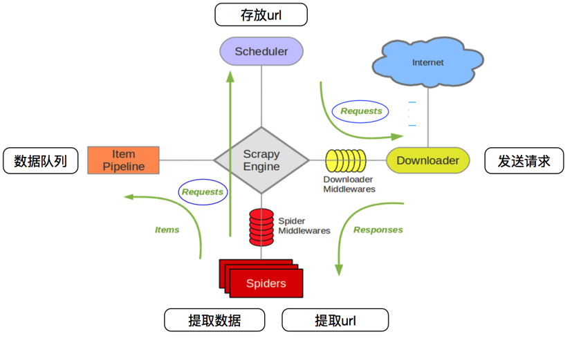
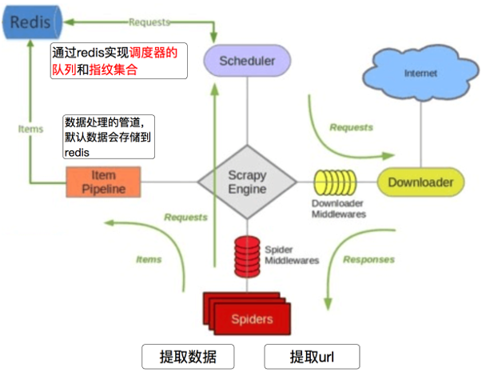

pip install -i https://pypi.tuna.tsinghua.edu.cn/simple some-package

# wirte
"I love {}".format("参数")
‘r’：读

‘w’：写

‘a’：追加

‘r+’ == r+w（可读可写，文件若不存在就报错(IOError)）

‘w+’ == w+r（可读可写，文件若不存在就创建）

‘a+’ ==a+r（可追加可写，文件若不存在就创建）

str.deocde()  默认为deocde("utf8")

/找到字符串con中的所有中文
''.join(re.compile('[^\u4e00-\u9fa5]').split(con))

--遍历某个dir文件夹下的所有文件并输出文件名和所在路径
```
for root,dirs,files in os.walk(dir):
     for file in files:
         print(os.path.join(root,file))


   #求交集的两种方式
    retA = [i for i in listA if i in listB]
    retB = list(set(listA).intersection(set(listB)))
    #求并集
    retC = list(set(listA).union(set(listB)))
    #求差集，在B中但不在A中
    retD = list(set(listB).difference(set(listA)))
``` 

# collections
## namedtuple
是一个函数，它用来创建一个自定义的tuple对象，并且规定了tuple元素的个数，并可以用属性而不是索引来应用tuple的某个元素、
```python
Point = namedtuple('Point',['x','y']) p = Point(1,3) p.x Out:1 p.y Out:2
```
## deque
使用list存储数据时，按索引访问元素很快，但是插入和删除元素就很慢了，因为list是线性存储，数据量大的时候，插入和删除效率很低。
deque是为了高效实现插入和删除操作的双向列表，适合用于队列和栈：
```python
>>> from collections import deque
>>> q = deque(['a', 'b', 'c'])
>>> q.append('x')
>>> q.appendleft('y')
>>> q
deque(['y', 'a', 'b', 'c', 'x'])
```
## defaultdict
使用dict时，如果引用的Key不存在，就会抛出KeyError。如果希望key不存在时，返回一个默认值，就可以用defaultdict：
```python
>>> from collections import defaultdict
>>> dd = defaultdict(lambda: 'N/A')
>>> dd['key1'] = 'abc'
>>> dd['key1'] # key1存在
'abc'
>>> dd['key2'] # key2不存在，返回默认值
'N/A'
```

## OrderedDict
使用dict时，Key是无序的。在对dict做迭代时，我们无法确定Key的顺序。
如果要保持Key的顺序，可以用OrderedDict：
OrderedDict的Key会按照插入的顺序排列，不是Key本身排序：
```python
>>> from collections import OrderedDict
>>> d = dict([('a', 1), ('b', 2), ('c', 3)])
>>> d # dict的Key是无序的
{'a': 1, 'c': 3, 'b': 2}
>>> od = OrderedDict([('a', 1), ('b', 2), ('c', 3)])
>>> od # OrderedDict的Key是有序的
OrderedDict([('a', 1), ('b', 2), ('c', 3)])
```
## Counter
Counter是一个简单的计数器，例如，统计字符出现的个数：
```python
>>> from collections import Counter
>>> c = Counter()
>>> for ch in 'programming':
...     c[ch] = c[ch] + 1
...
>>> c
Counter({'g': 2, 'm': 2, 'r': 2, 'a': 1, 'i': 1, 'o': 1, 'n': 1, 'p': 1})
```

# re
最后需要特别指出的是，正则匹配默认是贪婪匹配，也就是匹配尽可能多的字符
如果让\d+采用非贪婪匹配（也就是尽可能少匹配），才能把后面的0匹配出来，加个?就可以让\d+采用非贪婪匹配：
```
re.match(r'^(\d+?)(0*)$', '102300').groups()
('1023', '00')
```


Python strip() 方法用于移除字符串头尾指定的字符（默认为空格或换行符）或字符序列。

# Django
https://docs.djangoproject.com/zh-hans/2.2/intro/tutorial04/
## UWSGI
```
uwsgi --ini path  eg:uwsgi --ini uwsgi.ini
uwsgi --stop pidpath  eg: uwsgi --stop uwsgi.pid
```
## 基本操作

python
 python -m django --version

 django-admin startproject project_nams

 python manage.py runserver
 python manage.py runserver 192.168.1.50:8080
 python manage.py startapp App_name

 python manage.py createsuperuser
 # 助你检查项目中的问题，并且在检查过程中不会对数据库进行任何操作
 python manage.py check 

 # 进入交互式 Python 命令行，尝试一下 Django 为你创建的各种 API
  python manage.py shell
```


# modles

sqlmigrate 命令接收一个迁移的名称，然后返回对应的 SQL：
```python
python manage.py sqlmigrate App_name 0001

```


# 遇到Did you install mysqlclient问题[解决方法](https://stackoverflow.com/questions/51062920/pip-install-mysqlclient-error)
```bash
pip install --upgrade setuptools

apt install gcc libssl-dev
```


# scrapy
## 生成crawlspider的
scrapy genspider -t crawl cbirc cbirc.gov.cn
## 创建项目
创建一个scrapy项目
scrapy startproject mySpider

生成一个爬虫
scrapy genspider itcast "itcast.cn”

提取数据
完善spider，使用xpath等方法

保存数据
pipeline中保存数据

命令：scrapy startproject +<项目名字>
	   scrapy startproject myspider


## 完善spider



## spider的数据传到pipeline


## 使用pipline
完成pipline代码后需要在setting中开启

## 简单设置log
为了让我们自己希望输出到终端的内容能容易看一些：
	我们可以在setting中设置log级别
	在setting中添加一行（全部大写）：LOG_LEVEL = "WARNING”
	默认终端显示的是debug级别的log信息
## 实现翻页请求
scrapy.Request(url[, callback, method='GET', headers, body, cookies, meta, encoding='utf-8', priority=0, dont_filter=False, errback])
scrapy.Request能够构建一个request，同事指定提取数据的callback函数
scrapy.Request常用参数：
+	callback:指定传入的url交给那个解析函数去处理
+	meta:实现在不同的解析函数中传递数据，mata默认会带携带部分信息，比如下载延迟，请求深度等
+	dont_filter:默认url会经过allow_domain过滤。如果dont_filter设置为true，则当前地址不会被过滤


scrapy genspider -t crawl circ circ.gov.cn
使用crawl



